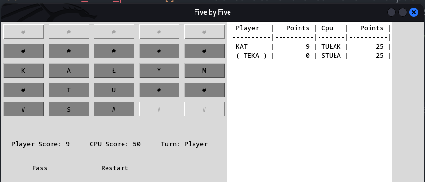

## Five-by-Five Word Game

### Description
This is a word game. Rules:
1. You need to add **one** letter to create a new word on a board.
2. New word should be only **nouns**, **singular**, not starting with capital letter
3. New word can be created by adding letter in up/down/left/right direction, **not across** the cells
4. You play against CPU. You can use only nouns in single form (eng?).

## Instalation and usage
1. Clone the respository
   `git clone https://github.com/ciach/5-by-5.git`
   or
   `gh repo clone ciach/5-by-5`
2. Install the requirements
   `pip install -r requirements.txt`
3. Run the game:
   `python3 main.py`

